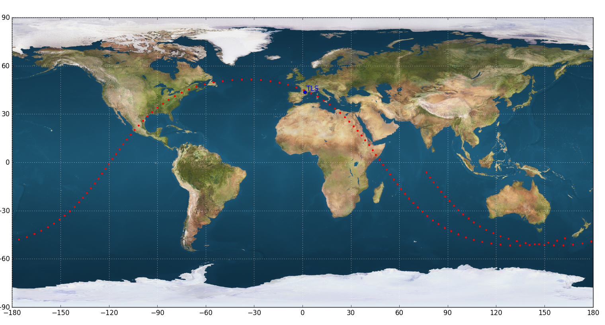
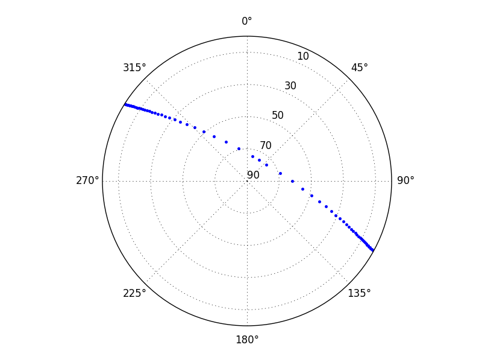

Examples of utilisation
=======================

.. warning:: Don't forget to set the :ref:`configuration` straight before anything.

Ground track
------------

.. literalinclude:: /_static/ground-track.py
    :language: python

Station pointings
-----------------

.. literalinclude:: /_static/station.py
    :language: python

which gives

.. code-block:: text

        Time      Azim    Elev    Distance   Radial Velocity
    =========================================================
    AOS 02:01:23  302.10   -0.00    2312.91   -6906.48
        02:01:39  302.30    1.00    2204.46   -6904.71
        02:02:09  302.71    3.07    1997.46   -6894.10
        02:02:39  303.20    5.39    1790.94   -6870.86
        02:03:09  303.79    8.08    1585.39   -6829.11
        02:03:39  304.54   11.30    1381.49   -6758.37
        02:04:09  305.53   15.29    1180.37   -6638.85
        02:04:39  306.94   20.51     984.03   -6430.17
        02:05:09  309.17   27.78     796.31   -6042.60
        02:05:39  313.28   38.63     625.31   -5262.66
        02:06:09  323.59   55.36     489.17   -3610.39
        02:06:39   12.81   74.28     423.23    -565.54
    MAX 02:06:43   30.39   75.00     421.90       0.00
        02:07:09   90.23   61.99     458.89    2806.46
        02:07:39  105.74   43.24     577.62    4871.54
        02:08:09  111.00   30.79     740.40    5857.82
        02:08:39  113.63   22.61     924.12    6336.73
        02:09:09  115.23   16.86    1118.38    6588.72
        02:09:39  116.32   12.54    1318.37    6730.93
        02:10:09  117.12    9.12    1521.66    6814.75
        02:10:39  117.74    6.29    1726.92    6864.71
        02:11:09  118.24    3.86    1933.33    6893.49
        02:11:39  118.65    1.72    2140.39    6908.11
    LOS 02:12:05  118.97    0.01    2323.42    6912.59

